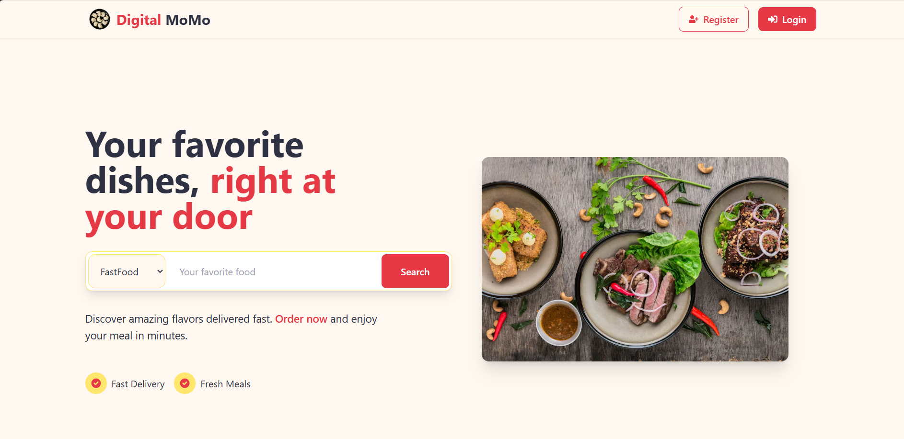
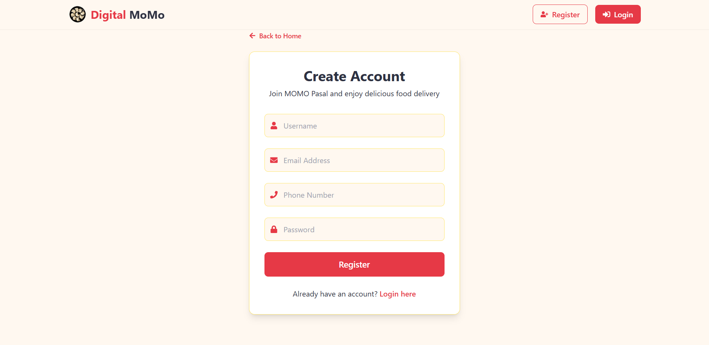
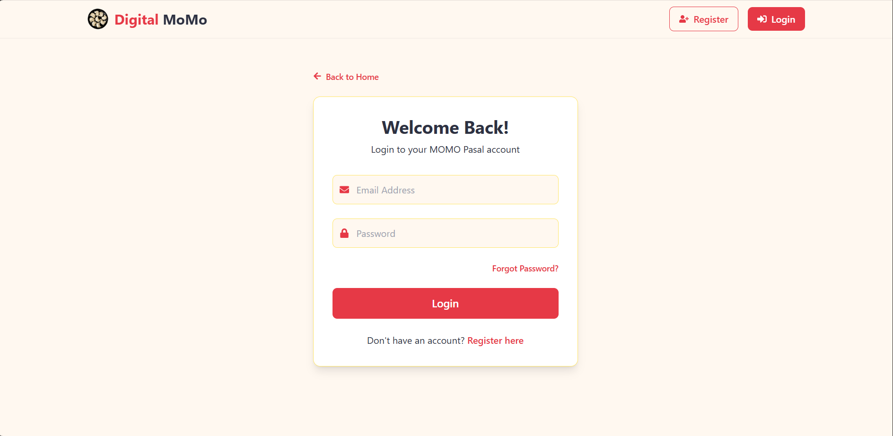
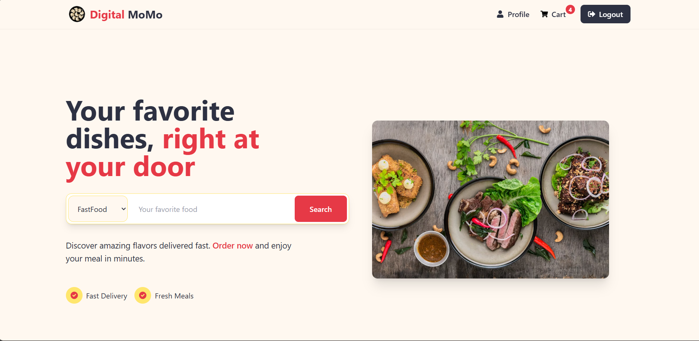
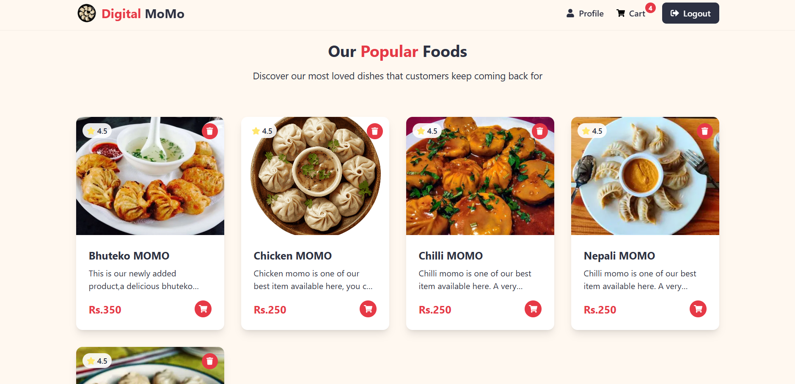
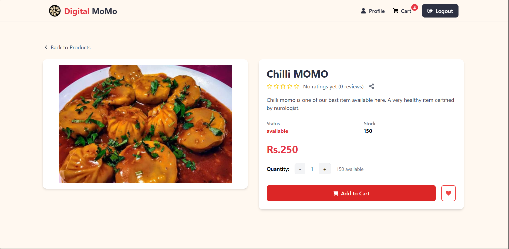
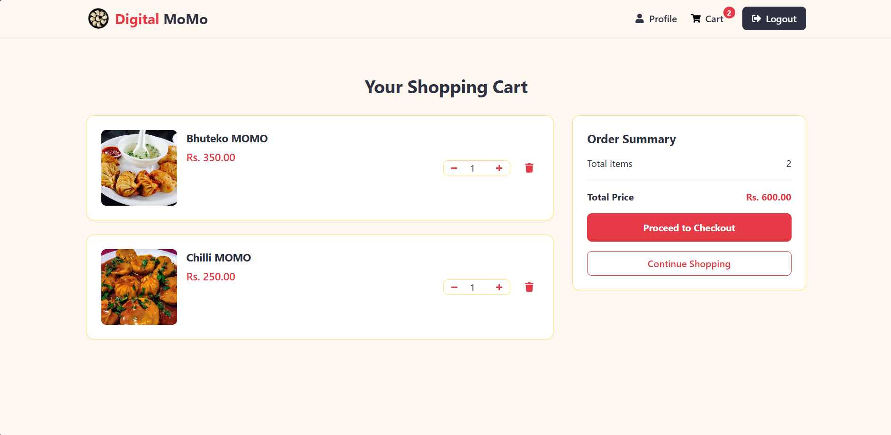
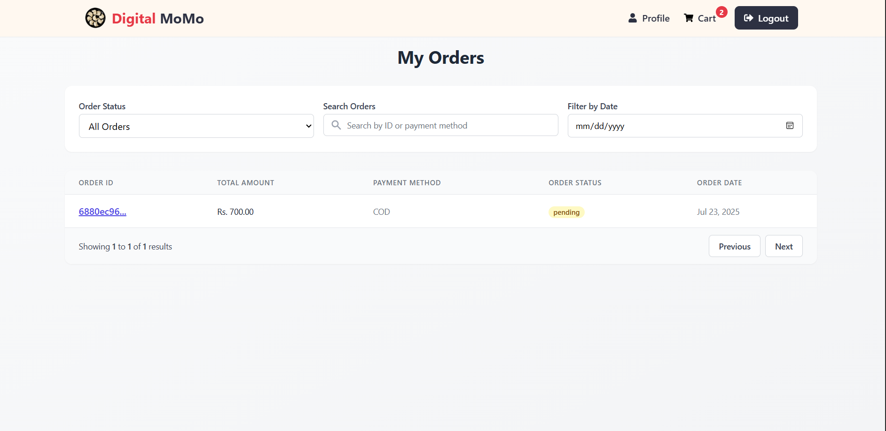
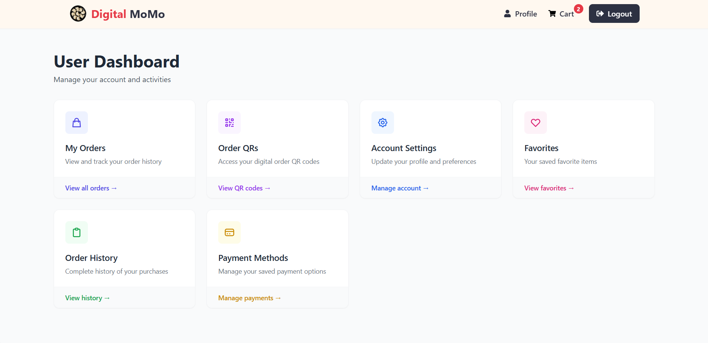

# Momo Pasal - Food Delivery Platform

MOMO Pasal is a full-stack, single-vendor web application designed for a local momo shop to manage and sell their products online. Built using the MERN stack (MongoDB, Express.js, React.js, and Node.js), the platform enables a momo business owner to digitally manage their menu, orders, and customers efficiently.

---

## **Click [Here](https://momo-pasal.vercel.app/) to visit site**

---

## Features

### Customer Features

- 🔍 Search and filter food items
- 🛒 Add to cart with quantity adjustment
- 💳 Multiple payment options (COD/Khalti)
- 📦 Order tracking and history
- 🍔 Browse restaurants and menu items\*
- ❤️ Favorite items and restaurants\*

### Admin Features

- 📊 Dashboard with sales analytics
- 📝 Order management
- 🏪 Restaurant management\*
- 🍽️ Menu item management\*
- 📊 Reports generation\*

## Tech Stack

### Frontend

- ⚛️ React.js with Vite
- 🎨 Tailwind CSS + Custom UI Components
- 🏗️ Redux Toolkit for state management
- 🚦 React Router for navigation
- 📝 React Hook Form for forms
- 🎯 React Icons

### Backend

- 🟢 Node.js with Express
- 🍃 MongoDB with Mongoose
- 🔑 JWT Authentication
- 💰 Khalti Payment Integration
- 📧 Email notifications (Nodemailer)
- 📄 PDF generation for invoices\*

## Screenshots

| Home Page                          | Login                                | Register                                   |
| ---------------------------------- | ------------------------------------ | ------------------------------------------ |
|  |  |  |

| Cart                               | My orders                              | User Dashboard                         |
| ---------------------------------- | -------------------------------------- | -------------------------------------- |
|  |  |  |

## Installation

### Prerequisites

- Node.js v16+
- MongoDB (Local or Atlas)
- Khalti Merchant Account (for payments)

## **Steps to Run**:

#### 1. Clone the repository:

```bash
git clone https://github.com/yogendrabaskota/Momo-Pasal.git
cd momo-pasal
```

#### 2. To Run backend

- Install required packages

```https
  npm install
```

- Run Backend server

```https
  npm start
```

#### 2. To Run Frontend

- Install required packages

```https
  npm install
```

- Start the frontend

```https
  npm run dev
```

### Note

- **Add the environment variable as given in .env.example**

---

### Note:

#### Don't forget to update the API path in the frontend if needed.

---

---

### Backend is live [Here](https://momo-pasal.onrender.com/)

### Frontend is live [Here](https://momo-pasal.vercel.app/)

## Output :












## Feedback

If you have any feedback, please reach out to me at yogendrabaskota18@gmail.com
